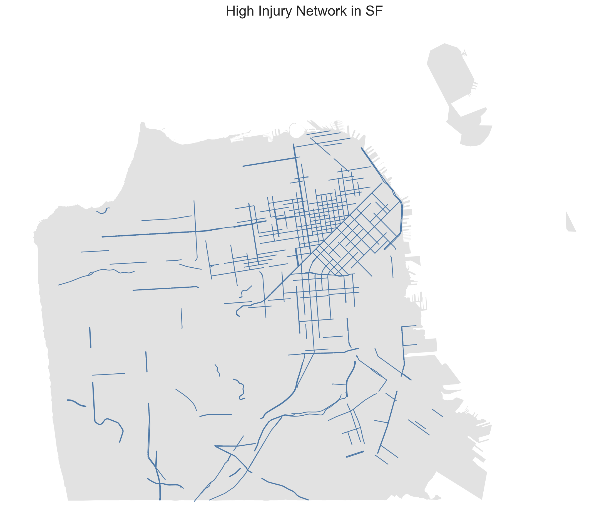
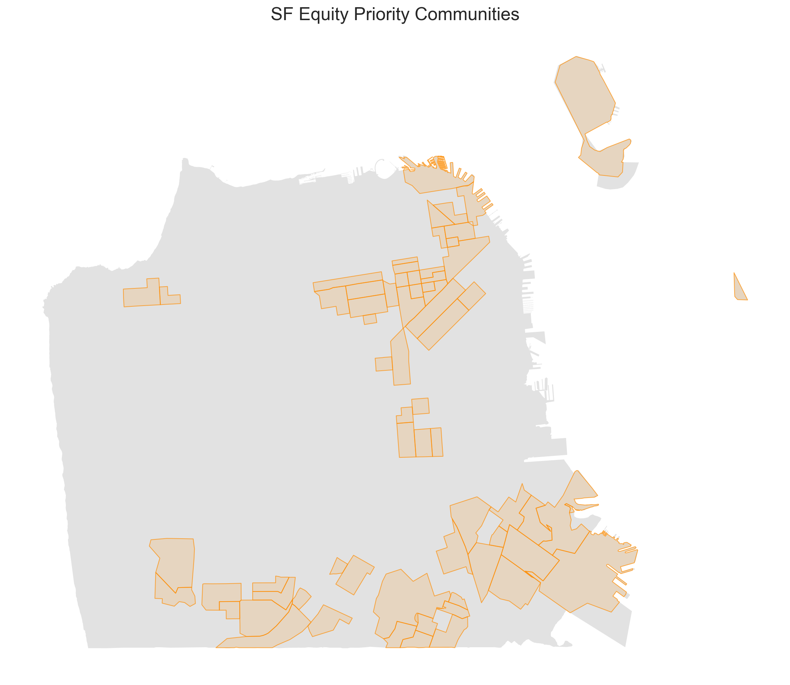

# San Francisco Crosswalks: Safety and Inequities
### Mike Hua
#### CYPLAN 255: Urban Informatics and Data Visualization
#### Spring 2022

# Introduction

In San Francisco, CA, there are around 30 traffic deaths and over 500 serious injuries each year. The City of SF, like many cities around the world, is pursuing a Vision Zero goal to have zero traffic deaths. Painted crosswalks are among the most basic forms of pedestrian infrastructure. Adding crosswalks is listed in SF's Vision Zero plan as a low-cost measure to increase safety.

# Analysis

This analysis builds upon the work of Marcel Moran, Ph.D. Candidate in City and Regional Planning at UC Berkeley. Moran published a study mapping crosswalk coverage at all intersections in San Francisco ([Moran, 2022](https://escholarship.org/uc/item/67447864)). Moran manually reviewed satellite imagery of the roughly 6,400 intersections in SF and recorded whether all pedestrian crossing had a painted crosswalk. The study used a binary "crosswalk" or "no crosswalk" designation"—if any crosswalks were missing from an intersection, it was marked as "no crosswalk". The paper for the study describe in further detail the methodology used and assumptions made.

This project aims to continue to study the spatial disparities of crosswalk coverage, as well as begin the process of developing a prioritization metric that can help SFMTA (SF's city department of transportation) understand which missing crosswalks should be given prioritized consideration for crosswalk installation.

## Inequitable Distribution of Crosswalks

Only 58% of intersections in San Francisco have full crosswalk coverage. Mapping out intersections with and without fully marked crosswalks shows a clear spatial disparity between the northern and southern areas of the city.

The below hexbin map further illustrates the spatial disparities of crosswalks in the city. Using arbitrary hexagonal geometries helps mitigate against potential error from the [Modifiable Areal Unit Problem](https://gisgeography.com/maup-modifiable-areal-unit-problem/). This map again shows that southern portions of SF have lower crosswalk coverage.

The below map shows crosswalk coverage by Supervisor District (the SF Board of Supervisors is the legislative body of the city). Again, intersections in the southern supervisor disctricts of SF are much less likely to have fully marked crosswalks. The disparity by supervisor district might also allude to differences in political power of districts to get infrastructure improvements, however further analysis is needed.

## Priority Crosswalk Installation

The high injury network (shown below in blue) is defined by the SF Vision Zero team and SF Public Health as the highest-concern streets for traffic injuries. The network represens the 12% of streets where over 70% of collisions occur.

The below map with all missing crosswalks overlaid on the high injury network does not show an observable spatial relationship.

Equity Priority Community is a designation created by the Metropolitan Transportation Commission (MTC), the regional planning agency for the SF Bay Area, to identify areas that have historically marginalized and underserved groups. Many SF and regional agencies use the Equity Priority Community framework to help prioritize transportation investments. MTC's GitHub page contains [details on the Equity Priority Community definition](https://bayareametro.github.io/Spatial-Analysis-Mapping-Projects/Project-Documentation/Equity-Priority-Communities/).

Overlaying the high injury network and Equity Priority Communities can help narrow down which missing crosswalks should be prioritized by the city. The dots shown here are all missing crosswalks that are on the high injury network and within an Equity Priority Community

Further narrowing of the set of priority missing crosswalks can be achieved by selecting intersection that have had a recent pedestrian collision. the below map shows data from SWITRS of all crashes involving pedestrians from 2015 to 2019. This time frame for the data was chosen because the 2020 and 2021 were still provisional at the time this analysis was conducted.

This data was used to select only missing crosswalks that have had at least one pedestrian collision from 2015 - 2019. A total of 28 intersections in San Francisco meet all four criteria:

1. At least one crossing in the intersection is missing a painted crosswalk
2. The intersection is on the high injury network
3. The intersection is within an Equity Priority Community
4. The intersection has had at least one pedestrian collision recorded in the past 5 years of available data (2015 - 2019).

This smaller set of 28 crosswalks are a more manageable number for city agencies to begin to further analyze.

This prioritization metric is intended as a starting point to begin conversations about which crosswalks are needed to be installed. Crosswalks are just one piece of the puzzle for pedestrian safety. Other infrastructure improvements like leading pedestrian intervals and curb bulb outs were not analyzed in this project, but are critical measures to take to get to Vision Zero goals.

# Discussion

From my initial analysis of the crosswalk audit data, its clear that there are spatial disparities in marked crosswalks. Northern areas of the city typically have more intersections with fully marked crosswalks than the southern areas of the city.

The city of San Francisco should work to address missing crosswalks at critical intersections and work to reduce the inequitable distribution of crosswalk coverage. The described crosswalk installation priority analysis would help the city prioritize crosswalks that are on high-injury streets and in historically-underserved areas that deserve prioritized investment.

# References

Moran, M. E. (2022). Where the Crosswalk Ends: Mapping Crosswalk Coverage via Satellite Imagery in San Francisco. Environment and Planning B: Urban Analytics and City Science, 23998083221081530. https://doi.org/10.1177/23998083221081530

Nelson, R. K., Winling, L., Marciano, R., & Connolly, N. (n.d.). Mapping Inequality. American Panorama. Retrieved May 9, 2022, from https://dsl.richmond.edu/panorama/redlining/

