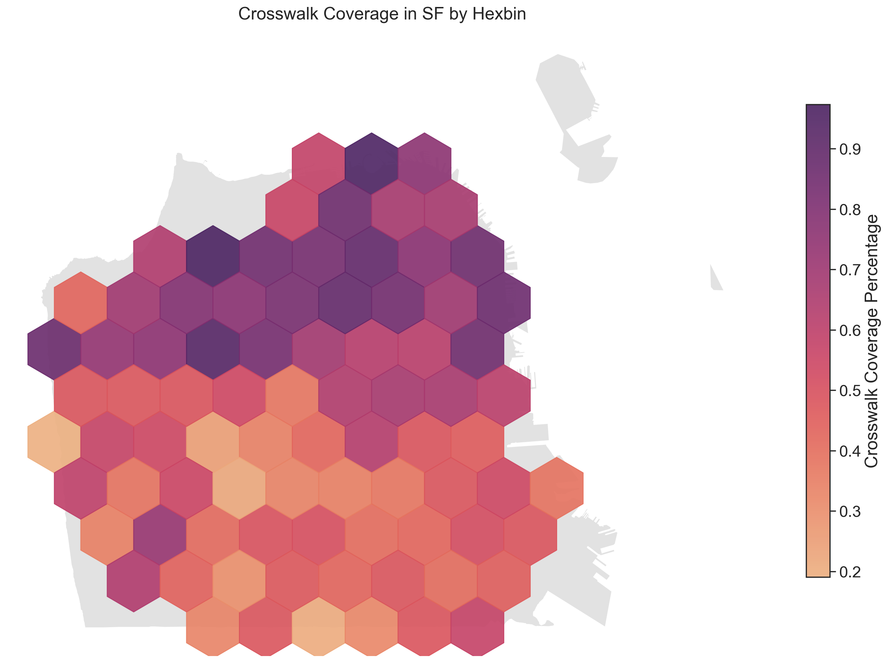

# San Francisco Crosswalks: Safety and Inequities
### Mike Hua
#### CYPLAN 255: Urban Informatics and Data Visualization
#### Spring 2022

## Introduction

## Analysis

### Inequitable Distribution of Crosswalks

### Priority Crosswalk Installation

## Results

## Discussion

## References
